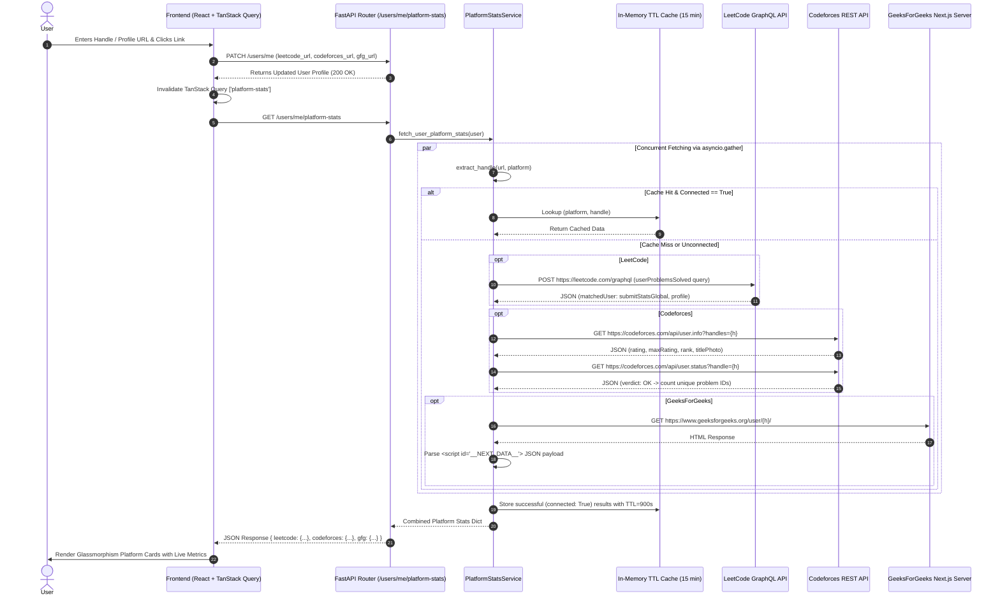

# 🚀 Connected Coding Platforms Feature — Interview Preparation Guide

This document is your complete architectural and technical guide for explaining the **Connected Coding Platforms (LeetCode, Codeforces, GeeksForGeeks Integration)** feature in a software engineering / system design interview.

---

## 📌 1. High-Level Executive Summary

### 🎯 Problem Statement
Competitive programmers and developers solve problems across multiple judge platforms (LeetCode, Codeforces, GeeksForGeeks). Showing only internal platform statistics misses a user's broader coding achievements.

### 💡 Solution
A unified, real-time **Connected Platforms Integration** that dynamically fetches, normalizes, and displays live coding metrics (problems solved, rating, global rank, difficulty breakdown, campus rank) across LeetCode, Codeforces, and GeeksForGeeks directly on the user's bugX profile.

---

## 🏗️ 2. System Architecture & Flowchart

### 🔄 End-to-End Sequence Diagram (Mermaid)

---

## 🛠️ 3. Component Breakdown & Implementation Details

### A. Handle Extraction Engine (`extract_handle`)
* **Challenge**: Users input messy strings: `@handle`, `handle`, `https://leetcode.com/u/handle/`, `https://codeforces.com/profile/handle?ref=123`.
* **Solution**:
  1. Strip whitespace, trailing slashes, query parameters (`?`), and URL fragments (`#`).
  2. Use platform-specific regex pattern matching (`leetcode\.com/(?:u/)?([a-zA-Z0-9_-]+)`).
  3. Fall back to reverse-path tokenization (extracting the last URL path segment while skipping platform keywords like `u`, `user`, `profile`, `http:`).
  4. Strip leading `@` characters.

### B. Live Third-Party Integration Protocols

| Platform | Protocol | Endpoint | Data Extracted |
|---|---|---|---|
| **LeetCode** | HTTP POST (GraphQL) | `https://leetcode.com/graphql` | Total Solved, Easy/Medium/Hard breakdown, Global Ranking, Reputation, Star Rating |
| **Codeforces** | HTTP GET (REST API) | `https://codeforces.com/api/user.info` & `user.status` | Rating, Max Rating, Rank Title (e.g. Candidate Master), Max Rank, Avatar, Solved Problem Count |
| **GeeksForGeeks** | HTTP GET (HTML Parsing) | `https://www.geeksforgeeks.org/user/{handle}/` | Next.js Server Side State (`__NEXT_DATA__` JSON): Overall Coding Score, Total Solved, Monthly Score, Campus Rank |

### C. Concurrency & Performance (`asyncio.gather`)
* Instead of sequentially fetching LeetCode → Codeforces → GFG (which would take ~1.5s total), `asyncio.gather(*tasks)` fires all 3 asynchronous HTTP requests in parallel using non-blocking I/O (`httpx.AsyncClient`).
* **Total Latency**: Drops from `t1 + t2 + t3` (~1500ms) down to `max(t1, t2, t3)` (~400ms).

### D. Smart Caching Strategy
* **Cache Storage**: In-memory dictionary `_stats_cache` keyed by `(platform, handle.lower())`.
* **TTL (Time to Live)**: 15 minutes (900 seconds).
* **Failure Guard**: Failed attempts (`connected: False`) are **never cached**. Only verified, successful integrations (`connected: True`) are stored. This allows immediate retry if a user fixes a misspelled handle.
* **Frontend Cache Invalidation**: Saving profile links in React triggers `queryClient.invalidateQueries({ queryKey: ['platform-stats'] })`, bypassing stale browser/React state instantly.

---

## 🎨 4. Frontend Architecture & Design

* **Glassmorphism Design System**: Built with semi-transparent frosted glass (`bg-white/[0.08]`, `backdrop-blur-2xl`), subtle borders (`border-white/[0.15]`), top chromatic glint lines, and HSL ambient radial glow blobs.
* **Inline Quick Connect UI**: Each platform card offers both static views and inline interactive forms for entering handles directly without context-switching to a settings modal.
* **Dynamic Codeforces Rank Colorizer**: Maps Codeforces ratings to official rank colors (e.g. ≥2400 Red/Grandmaster, ≥2100 Orange/Master, ≥1900 Violet/CM, ≥1600 Blue/Expert, ≥1400 Cyan/Specialist, ≥1200 Green/Pupil).

---

## ❓ 5. Likely Interview Questions & Answers

### Q1: How do you handle third-party API rate limits and unexpected downtime?
> **Answer**: 
> 1. We use an **in-memory TTL cache (15 min)** so subsequent profile views hit zero third-party endpoints.
> 2. Requests use **strict HTTP timeouts (10s)** via `httpx.AsyncClient`.
> 3. Each platform call is wrapped in individual `try/except` blocks inside `asyncio.gather(return_exceptions=True)`. If Codeforces is down, LeetCode and GFG stats still load perfectly without crashing the user's profile.

### Q2: Why scrape GFG's `__NEXT_DATA__` script tag instead of traditional DOM scraping?
> **Answer**:
> DOM CSS classes change frequently (e.g., Tailwind hashed classes or dynamic class names). GFG is a Next.js web application. Next.js embeds its initial SSR state into `<script id="__NEXT_DATA__" type="application/json">`. Parsing this structured JSON object using regex + `json.loads()` is 100x faster, type-safe, and resistant to HTML layout changes.

### Q3: How does the system scale if traffic increases to 100,000 active users?
> **Answer**:
> 1. **Distributed Caching**: Upgrade the in-memory Python dictionary cache to **Redis**. This allows multiple API worker instances (Gunicorn/Uvicorn) to share the cache and prevents duplicate fetches.
> 2. **Background Celery / Redis Queue Workers**: Instead of fetching stats synchronously on page load, spawn periodic background cron jobs (e.g., every 6 hours) to refresh connected platform stats into PostgreSQL/Redis asynchronously. Profile reads become $O(1)$ database/cache lookups.

### Q4: How do you handle handle extraction for edge cases?
> **Answer**:
> We implement a multi-tiered normalizer:
> 1. **URL Sanitization**: Remove trailing slashes, query parameters (`?ref=...`), and hash fragments (`#...`).
> 2. **Domain-Specific Regex**: Match platform domain patterns (e.g., `leetcode.com/(?:u/)?([a-zA-Z0-9_-]+)`).
> 3. **Reverse Path Segment Traversal**: Split by `/` and grab the last token that is not a platform domain keyword (skipping `u`, `user`, `profile`, `http:`).
> 4. **Sanitize Leading At-Sign**: Strip `@` prefix if present.

---

## 📊 Summary Cheat Sheet for Interview

| Concept | Technique Used | Key Benefit |
|---|---|---|
| **API Concurrency** | `asyncio.gather` with `httpx` | 3x faster response time |
| **Resilience** | `return_exceptions=True` | Fault isolation (1 failure doesn't break others) |
| **GFG Data Extraction** | Next.js `__NEXT_DATA__` JSON parsing | Robust against CSS/DOM changes |
| **Caching Policy** | Conditional TTL (Only cache `connected: True`) | Fast response + instant retry on fix |
| **State Sync** | TanStack Query Cache Invalidation | Instant UI updates post-save |
